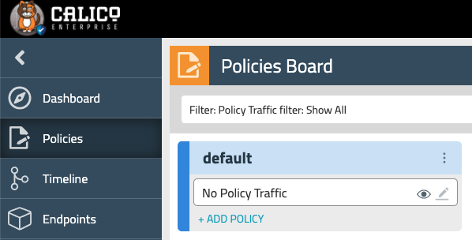

# 2. Network Policies Basics
In this lab we will implement basic policies to secure yaobank app and setup policy hierarchy. 

Steps: \
2.1. Setup policy tiers \
2.2. Apply policies to allow dns \
2.3. Apply policies to secure yaobank app \
2.4. Test


## 2.1. Setup policy tiers

The first step is to setup policy tiers which represent the policy hierarchy in your cluster. Policy tiers are containers that allow different personas in your organization define policies into groups of different priorities based on their roles and governed by RBAC. In this example, we are defining 3 policy tiers (Platform, Security, Application), which are typical personas involved in policy development.

Navigate to the policy board using the toolbar on the left and click on "Policies".



You will see only 1 tier (the `default` one). There will be another tier that you can make visible by clicking on the `Toggle Tiers` icon in the top right corner . These are the rules we applied for the essential Tigera components as part of the previous lab during the installation in step 1.1.5. 

Examine and apply the manifest file as below and notice three new tiers will show up.

```
kubectl apply -f -<<EOF
apiVersion: projectcalico.org/v3
kind: Tier
metadata:
  name: security
spec:
  order: 300
---
apiVersion: projectcalico.org/v3
kind: Tier
metadata:
  name: platform
spec:
  order: 200
---
apiVersion: projectcalico.org/v3
kind: Tier
metadata:
  name: application
spec:
  order: 400
EOF

```

Notice the order which represents the order of processing of the tier. 

```
calicoctl get tiers
```
```
NAME           ORDER   
allow-tigera   100     
platform       200     
security       300     
application    400     
default        <nil>    
```

## 2.2. Apply policies to allow dns

Next we will apply policies to allow ingress and egress communication with kubedns. DNS is a vital component of the cluster and is often linked to microservices communication issues or slowness. This will implement the failsafe rule for kube dns to avoid bricking it as we develop our policies.
Notice the ingress and egress direction of flow with respect to selected endpoints, where ingress are incoming to the endpoint and egress are outgoing from the endpoint. Policy is applied at the Security tier level, which implements standard high-level enterprise controls. This avoids lower privileged users from modifying it and the policy order guarantees precedence over other policies in that tier. We are using NetworkPolicies to apply to the kube-system namespace specifically, which hosts kube dns.

```
kubectl apply -f -<<EOF
apiVersion: projectcalico.org/v3
kind: NetworkPolicy
metadata:
  name: security.ingress-allow-pods-to-kubedns
  namespace: kube-system
spec:
  tier: security
  order: 1
  selector: k8s-app == "kube-dns"
  types:
    - Ingress
    - Egress
  ingress:
  - action: Allow
    destination:
      ports:
      - 53
    protocol: UDP
  - action: Allow
    destination:
      ports:
      - 53
    protocol: TCP
  egress:
  - action: Allow
    destination:
      ports:
      - 53
    protocol: UDP
  - action: Allow
    destination:
      ports:
      - 53
    protocol: TCP
EOF

```
```
kubectl get networkpolicies.crd -n kube-system
```
```
NAME                                     AGE
security.ingress-allow-pods-to-kubedns   2m7s
```

## 2.3. Apply policies to secure yaobank app

Last step in this lab is to apply Calico network policies to yaobank namespace to secure yaobank services communication. 
Notice the order of policies which is only relevant in a sequential policy processing where you expect multiple matches in the same tier for selected endpoints. It's not the case here however it's a good practice to follow a logical ordering process to simplify troubleshooting and analysis.

```
kubectl apply -f -<<EOF
apiVersion: projectcalico.org/v3
kind: NetworkPolicy
metadata:
  name: application.ingress-allow-all-to-summary
  namespace: yaobank
spec:
  tier: application
  order: 101
  selector: app == "customer"
  types:
    - Ingress  
  ingress:
  - action: Allow
    protocol: TCP
    destination:
      ports:
      - 80
---
apiVersion: projectcalico.org/v3
kind: NetworkPolicy
metadata:
  name: application.ingress-allow-customer-to-summary
  namespace: yaobank
spec:
  tier: application
  order: 102
  selector: app == "summary"
  types:
    - Ingress  
  ingress:
  - action: Allow
    protocol: TCP
    source:
      selector: app == "customer"
    destination:
      ports:
      - 80
---
apiVersion: projectcalico.org/v3
kind: NetworkPolicy
metadata:
  name: application.ingress-allow-summary-to-database
  namespace: yaobank
spec:
  tier: application
  order: 103
  selector: app == "database"
  types:
    - Ingress  
  ingress:
  - action: Allow
    protocol: TCP
    source:
      selector: app == "summary"
    destination:
      ports:
      - 2379
---
apiVersion: projectcalico.org/v3
kind: NetworkPolicy
metadata:
  name: application.ingress-yaobank-default-deny
  namespace: yaobank
spec:
  tier: application
  order: 104
  selector: all()
  types:
    - Ingress  
  ingress:
  - action: Deny
EOF

```

```
kubectl get networkpolicies.crd -n yaobank
```
```
NAME                                            AGE
application.ingress-allow-all-to-summary        2s
application.ingress-allow-customer-to-summary   2s
application.ingress-allow-summary-to-database   2s
application.ingress-yaobank-default-deny        2s
```

## 2.4. Testing

Verify that yaobank app is still working properly. Modify the hostname to your own LABNAME.
https://yaobank.LABNAME.lynx.tigera.ca/ 

Now verify the endpoints used by yaobank database and the IP address of the pods in the app2 namespace.

```
kubectl get endpoints database -n yaobank
```
```
NAME       ENDPOINTS          AGE
database   10.48.0.209:2379   120m
```
```
kubectl get pod -n app1
```
```
NAME                               READY   STATUS    RESTARTS   AGE
app1-deployment-5bbfd76f9d-jvmzj   1/1     Running   0          12m
app1-deployment-5bbfd76f9d-mzjzd   1/1     Running   0          12m
```
```
kubectl get pod -n app2 -o wide
```
```
NAME                               READY   STATUS    RESTARTS   AGE    IP            NODE                                         NOMINATED NODE   READINESS GATES
app2-deployment-5fd465d59f-7r79r   1/1     Running   0          122m   10.48.0.211   ip-10-0-1-31.ca-central-1.compute.internal   <none>           <none>
app2-deployment-5fd465d59f-qck2w   1/1     Running   0          122m   10.48.0.85    ip-10-0-1-30.ca-central-1.compute.internal   <none>           <none>
```

We will test the connectivity from one of the pods in the app1 namespace:

```
APP1_POD=$(kubectl get pod -n app1 --no-headers -o name | head -1) && echo $APP1_POD
```
```
kubectl exec -ti $APP1_POD -n app1 -- sh
```

Verify you cannot access the etcd port in the database deployment (use the IP address from the database pod you retrieved earlier):

```
# telnet 10.48.0.209:2379
```

However the yaobank rules allow us to access the resource from the `summary` microservice, so your browser should still be able to access yaobank.

Access to any of the app2 pods should be successful (replace the IP for any of the two pods in the namespace app2 your retrieved before).

```
# ping 10.48.0.211
```

Access to external destinations should be successful

```
curl -I https://www.tigera.io
```
