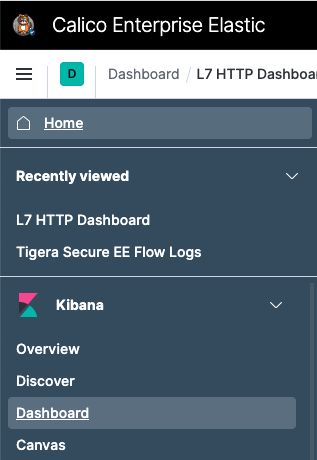
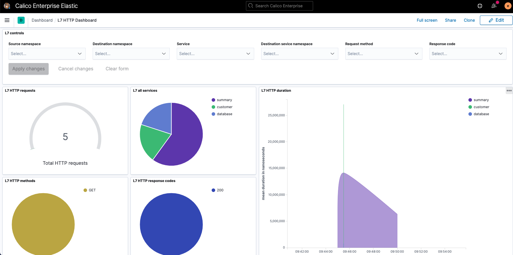

# 9 Observability - Dashboards

In this lab, we will enable application layer data in flow logs.

Steps: \
9.1 Configure Felix for log data collection \
9.2 Configure ApplicationLayer CRD \
9.3 Select traffic for L7 log collection \
9.4 Test your configuration \
9.5 Check the Kibana Dashboard 


## 9.1 Configure Felix for log data collection

First we need to enable the Policy Sync API in Felix. 
To do this cluster-wide, modify the default FelixConfiguration to set the field policySyncPathPrefix to /var/run/nodeagent.

```
kubectl patch felixconfiguration default --type='merge' -p '{"spec":{"policySyncPathPrefix":"/var/run/nodeagent"}}'
```

## 9.2 Configure ApplicationLayer CRD

In this step, you configure ApplicationLayer resource to gather the L7 logs.

Create the ApplicationLayer resource named, tigera-secure: 
Ensure that collectLogs fields is set to Enabled.

```
kubectl apply -f -<<EOF
apiVersion: operator.tigera.io/v1
kind: ApplicationLayer
metadata:
  name: tigera-secure
spec:
  logCollection:
    collectLogs: Enabled
    logIntervalSeconds: 5
    logRequestsPerInterval: -1
EOF
```


## 9.3. Select traffic for L7 log collection

In order to select which traffic gets included in the L7 log collection we must annotate the service. Let’s do that for customer, database & summary: 

```
kubectl annotate svc customer -n yaobank projectcalico.org/l7-logging=true
kubectl annotate svc database -n yaobank projectcalico.org/l7-logging=true
kubectl annotate svc summary -n yaobank projectcalico.org/l7-logging=true

```

## 9.4. Test your configuration

To test your configuration lets drive some http traffic to one of the services we annotated above. 

Firstly fetch & take note of the correct IP for your customer service:

```
kubectl get svc -n yaobank
```

Now let’s initiate some http traffic to that service from worker1:

```
ssh worker1
curl –head <ip of customer's pod>
```

Please run the curl command multiple times to generate a number of entries in the logs.

## 9.5 Check the Kibana Dashboard


Access kibana from the left tool bar with the icon . The default username is `elastic`.

Now select the Dashboards as indicated in the figure below, and then L7 HTTP Dashboard:



There you will see the Application level Dashboard for the yaobank application



## 9.5 Cleanup

In the terminal where the script is running, execute the following command to stop the script (copy and paste to your terminal):

```
rm /tmp/runscript
```

After hitting the `Enter` key a couple of times, you should see a message as the one below:

```
[1]+  Done                    while [ -f /tmp/runscript ]; do
    curl -si $(kubectl get svc -n yaobank | grep customer | awk {'print $3'}) | head -1; sleep 2;
done
```

